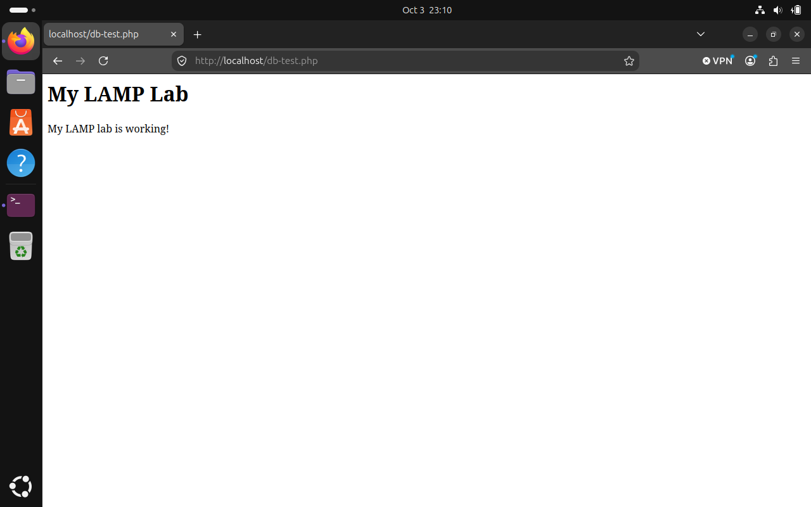

# Ubuntu LAMP Home Lab

I built a working LAMP environment in an Ubuntu virtual machine using VirtualBox. This project documents my setup, testing, troubleshooting, and results.

LAMP stands for Linux, Apache, MySQL, and PHP.

## Tools Used

- Ubuntu Linux
- Oracle VirtualBox
- Apache web server
- MySQL database
- PHP

## What I Built

- Installed Ubuntu and updated its packages.
- Installed and verified Apache, MySQL, and PHP.
- Created the `lamp_lab` database and a `messages` table.
- Created a database account with limited permissions.
- Stored database credentials outside the web root.
- Built a PHP page that retrieves and displays a message from MySQL.

## Results

Apache and MySQL were running successfully. The PHP test page displayed “PHP is working!” and the database test page displayed “My LAMP lab is working!”

This verified that Apache, PHP, and MySQL worked together.

## Troubleshooting

During the lab, I worked through:

- Virtual machine startup issues.
- A restart blocked by the desktop session.
- Entering a browser URL in the terminal.
- Confusion between Ubuntu and MySQL passwords.
- Difficulty pasting into the virtual machine.
- A database connection failure diagnosed through Apache’s error log.

I shared screenshots with ChatGPT for guidance, performed the steps myself, and documented the errors and confirmed outcomes.

## Full Documentation

[Read the complete lab write-up](Ubuntu-LAMP-Lab-Writeup.md)

## Project Status

Core lab completed and tested. This is a local learning environment.
